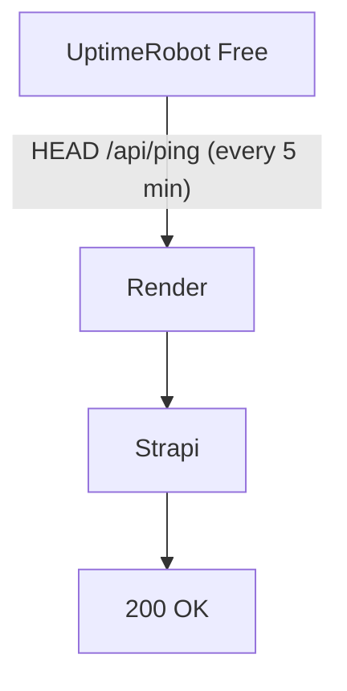

import Tabs from '@theme/Tabs';
import TabItem from '@theme/TabItem';

# 🌙 Keeping a Strapi API on Render Free from Going Idle

:::danger[The Problem]
Render's **Free** web services spin down after **15 minutes** of no inbound HTTP traffic. Once idle, your Strapi API stops responding until the next request wakes it up — which can take 30–60 seconds and breaks your app's UX.
:::

**The fix:** set up an external monitor that pings your API every few minutes so it never falls asleep. Here's the full flow:



:::tip[Why HEAD and not GET?]
UptimeRobot's **free tier only supports HTTP monitors that send `HEAD` requests**, not `GET`. So our Strapi endpoint needs to handle `HEAD` gracefully — while still returning real JSON to normal users making `GET` requests.
:::

----

## 🧭 Overview

| Step | What you'll do |
|---|---|
| 1 | Scaffold a new `ping` API in Strapi |
| 2 | Add the route + controller |
| 3 | Test locally (`HEAD` and `GET`) |
| 4 | Deploy to Render |
| 5 | Test the production endpoint |
| 6 | Wire up UptimeRobot |

----

## 1️⃣ Scaffold the `ping` API

Inside your Strapi project, create the following folder structure:

```text
src/
└── api/
    └── ping/
        ├── controllers/
        └── routes/
```

----

## 2️⃣ Add the Route and Controller

<Tabs>
<TabItem value="route" label="src/api/ping/routes/ping.js">

```js
module.exports = {
  routes: [
    {
      method: 'GET',
      path: '/ping',
      handler: 'ping.index',
      config: {
        auth: false,
      },
    },
  ],
};
```

</TabItem>
<TabItem value="controller" label="src/api/ping/controllers/ping.js">

```js
'use strict';

module.exports = {
  async index(ctx) {
    ctx.body = {
      status: 'ok',
    };
  },
};
```

</TabItem>
</Tabs>

:::info[Why only `GET` in the route?]
You don't need a separate `HEAD` route — HTTP servers (and Strapi/Node under the hood) automatically respond to `HEAD` requests on any route that supports `GET`, just without a response body. One route handles both cases. ✅
:::

----

## 3️⃣ Test It Locally

Start your Strapi development server:

```bash
npm run develop
```

Open a **second** terminal window and test both request types:

<Tabs>
<TabItem value="head" label="HEAD request">

```powershell
curl.exe -I http://localhost:1337/api/ping
```

Expected result:

```text
HTTP/1.1 200 OK
```

If you see this, your Strapi/Node stack is handling `HEAD` correctly 🎉

</TabItem>
<TabItem value="get" label="GET request">

```powershell
curl.exe http://localhost:1337/api/ping
```

Expected result:

```json
{ "status": "ok" }
```

</TabItem>
</Tabs>

----

## 4️⃣ Commit and Deploy

Push your changes so Render picks up the new endpoint:

```bash
git add .
git commit -m "Add ping endpoint to keep Render service awake"
git push -u origin main
```

Render will automatically redeploy your service after the push.

----

## 5️⃣ Verify the Production Endpoint

Once deployed, confirm the live endpoint responds correctly:

```bash
curl https://your-app.onrender.com/api/ping
```

You should get:

```json
{ "status": "ok" }
```

:::caution[Double-check your path]
Make sure you're hitting the exact route you registered (`/api/ping`, singular) — a typo like `/api/pings` will 404.
:::

If that works — your API is live and ready to be monitored. ✅

----

## 6️⃣ Set Up UptimeRobot

1. Go to the [UptimeRobot dashboard](https://dashboard.uptimerobot.com/monitors) and create a free account.
2. Click **Add New Monitor**.
3. Configure it as follows:

| Field | Value |
|---|---|
| **Monitor Type** | HTTP(s) |
| **Friendly Name** | Ping \<Your App Name\> |
| **URL to monitor** | `https://your-app.onrender.com/api/ping` |
| **Monitoring Interval** | 5 minutes |

4. Click **Create Monitor**.

That's it — UptimeRobot will now send a `HEAD` request every 5 minutes, well within Render's 15-minute idle window, keeping your Strapi API awake 24/7. 🚀

----

## ✅ Recap

- Render Free spins down after 15 min of inactivity.
- UptimeRobot's free tier only sends `HEAD` requests.
- A single `GET /api/ping` route in Strapi transparently handles both `HEAD` and `GET`.
- Point an UptimeRobot HTTP(s) monitor at that endpoint, polling every 5 minutes.
- Normal users hitting `GET /api/ping` still get a clean `{ "status": "ok" }` response.